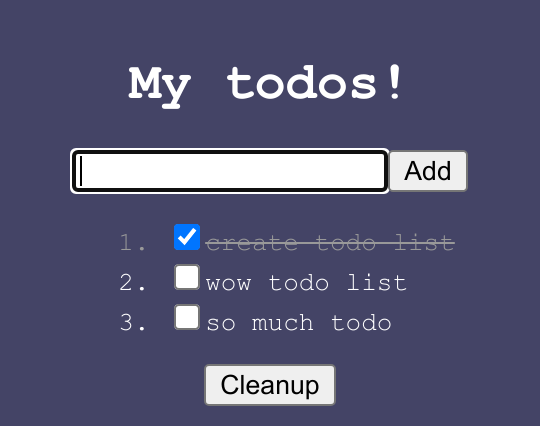

<h1>
mixter <a href="https://npmjs.org/package/mixter"></a> <a href="src"></a> <a href="https://cdn.jsdelivr.net/npm/mixter@0.0.2/dist/mixter.min.js"></a> <a href="LICENSE"></a>
</h1>

<p></p>

A Web Components framework.

<h4>
<table><tr><td title="Triple click to select and copy paste">
<code>npm i mixter </code>
</td><td title="Triple click to select and copy paste">
<code>pnpm add mixter </code>
</td><td title="Triple click to select and copy paste">
<code>yarn add mixter</code>
</td></tr></table>
</h4>

## Examples

<details id="example$simple" title="simple" open><summary><span><a href="#example$simple">#</a></span>  <code><strong>simple</strong></code></summary>  <ul>    <details id="source$simple" title="simple source code" open><summary><span><a href="#source$simple">#</a></span>  <code><strong>view source</strong></code></summary>  <a href="example/simple.tsx">example/simple.tsx</a>  <p>

```tsx
/** @jsxImportSource mixter/jsx */
import { create } from 'mixter'
import { jsx } from 'mixter/jsx'

export const App = create(
  class {
    who = 'world'
  },
  ({ $ }) => {
    const { render } = jsx($)
    render(({ who }) => <div>Hello, {who}!</div>)
  }
)
```

</p>
</details></ul></details><details id="example$todo-app" title="todo-app" open><summary><span><a href="#example$todo-app">#</a></span>  <code><strong>todo-app</strong></code></summary>  <ul><p></p>  <a href="https://stagas.github.io/mixter/example/todo-app.html"></img>  <p><strong>Try it live</strong></p></a>    <details id="source$todo-app" title="todo-app source code" ><summary><span><a href="#source$todo-app">#</a></span>  <code><strong>view source</strong></code></summary>  <a href="example/todo-app.tsx">example/todo-app.tsx</a>  <p>

```tsx
/** @jsxImportSource mixter/jsx */
import { attrs, css, event, events, mixter, props, shadow, state } from 'mixter'
import { jsx, refs } from 'mixter/jsx'

type Todo = {
  name: string
  done: boolean
}

export class TodoApp extends mixter(
  // Extend basic HTMLElement
  HTMLElement,
  // Attach ShadowRoot
  shadow(),
  // Declare the events we will be emitting, this allows for
  // `el.onsomeevent = fn` to be statically typed
  events<{
    done: CustomEvent<{ todo: Todo }>
  }>(),
  // Element attributes, can be String, Number, Boolean
  attrs(
    class {
      name = 'My todos!'
      background = '#446'
      todoColor = '#fff'
      doneColor = '#999'
    }
  ),
  // Declare properties, can be any type
  props(
    class {
      form?: HTMLFormElement
      textInput?: HTMLInputElement
      todos: Todo[] = [
        { name: 'create todo list', done: true },
        { name: 'wow todo list', done: false },
        { name: 'so much todo', done: false },
      ]
      onTodoCleanup?: () => void
      onTodoAdd?: () => void
      onTodoChange?: (todo: Todo) => (
        e: Event & { currentTarget: HTMLInputElement },
      ) => void
    }
  ),
  // Reactive state handler
  state<TodoApp>(({ $, effect, reduce }) => {
    // Use jsx, returns the render function which acts like a `reduce`
    // that instead renders on the root element.
    const { render } = jsx($)
    // Use refs, `ref.someElement` can now be passed to `ref=` attributes in JSX.
    // Refs are bidirectional, meaning if they already have a reference, passing them to
    // a JSX element will "give" that element by reference, instead of filling "from" it.
    const { ref } = refs($)

    $.onTodoAdd = reduce(({ textInput, todos }) => (event().prevent.stop(() => {
      $.todos = [...todos, { name: textInput.value, done: false }]
      textInput.value = ''
      textInput.focus()
      // initialized with a noop function otherwise the render() below will never "fire"
      // because we are in its dependencies and our dependency `textInput` is
      // assigned inside it.
    })), () => {})

    $.onTodoChange = reduce(({ host, todos }) => (todo => (e => {
      todo.done = e.currentTarget.checked
      $.todos = [...todos]
      if (todo.done) host.dispatch('done', { todo })
    })))

    $.onTodoCleanup = reduce(({ todos }) => (() => {
      $.todos = [...todos.filter(todo => !todo.done)]
    }), () => {})

    effect(({ todos }) => {
      if (todos.length > 0 && todos.filter(todo => !todo.done).length === 0)
        alert('All done! Congrats!')
    })

    render((
      {
        name,
        background,
        doneColor,
        onTodoAdd,
        onTodoChange,
        onTodoCleanup,
        todoColor,
        todos,
      },
    ) => (
      <>
        <style>
          {css`
          width: 250px;
          padding: 10px;
          display: inline-flex;
          flex-flow: column nowrap;
          align-items: center;
          font-family: 'Ubuntu Mono', monospace;
          background: ${background};
          color: ${todoColor};
          .done {
            color: ${doneColor};
          }
          `()}
        </style>

        <h1>{name}</h1>

        <form
          onsubmit={onTodoAdd}
          style={{
            display: 'flex',
            flexFlow: 'column nowrap',
            alignItems: 'center',
          }}
        >
          <div>
            <input ref={ref.textInput} type="text" autofocus />
            <button type="submit">Add</button>
          </div>

          <ol>
            {todos.map(todo => (
              <li class={todo.done ? 'done' : ''}>
                <label>
                  <input
                    type="checkbox"
                    checked={todo.done}
                    onchange={onTodoChange(todo)}
                  />
                  {todo.done
                    ? <strike>{todo.name}</strike>
                    : todo.name}
                </label>
              </li>
            ))}
          </ol>

          {todos.some(todo => todo.done)
            && <button onclick={onTodoCleanup}>Cleanup</button>}
        </form>
      </>
    ))
  })
) {}

customElements.define('todo-app', TodoApp)

const todoApp = new TodoApp()

document.body.appendChild(todoApp)

todoApp.ondone = ({ detail: { todo } }) => {
  console.log('done', todo)
  // change background to a random hue every time we finish a todo
  todoApp.background = `hsl(${Math.random() * 360}, 30%, 20%)`
}
```

</p>
</details></ul></details><details id="example$web" title="web" open><summary><span><a href="#example$web">#</a></span>  <code><strong>web</strong></code></summary>  <ul>    <details id="source$web" title="web source code" open><summary><span><a href="#source$web">#</a></span>  <code><strong>view source</strong></code></summary>  <a href="example/web.ts">example/web.ts</a>  <p>

```ts
import { App } from './simple'

customElements.define('x-app', App)

const app = new App()
document.body.appendChild(app)
```

</p>
</details></ul></details>

## API

<p>  <details id="EventHandler$21" title="Interface" ><summary><span><a href="#EventHandler$21">#</a></span>  <code><strong>EventHandler</strong></code>    </summary>  <a href="src/mixins/events.ts#L3">src/mixins/events.ts#L3</a>  <ul>    <p>    <details id="e$25" title="Parameter" ><summary><span><a href="#e$25">#</a></span>  <code><strong>e</strong></code>    </summary>    <ul><p><a href="#E$23">E</a> &amp; {<p>  <details id="currentTarget$27" title="Property" ><summary><span><a href="#currentTarget$27">#</a></span>  <code><strong>currentTarget</strong></code>    </summary>  <a href="src/mixins/events.ts#L4">src/mixins/events.ts#L4</a>  <ul><p><a href="#T$22">T</a></p>        </ul></details><details id="target$28" title="Property" ><summary><span><a href="#target$28">#</a></span>  <code><strong>target</strong></code>    </summary>  <a href="src/mixins/events.ts#L4">src/mixins/events.ts#L4</a>  <ul><p><span>Element</span></p>        </ul></details></p>}</p>        </ul></details>  <p><strong>EventHandler</strong><em>(e)</em>  &nbsp;=&gt;  <ul>void</ul></p></p>    </ul></details><details id="Class$450" title="TypeAlias" ><summary><span><a href="#Class$450">#</a></span>  <code><strong>Class</strong></code>    </summary>  <a href="src/types.ts#L1">src/types.ts#L1</a>  <ul><p><details id="__type$451" title="Constructor" ><summary><span><a href="#__type$451">#</a></span>  <em>(args)</em>    </summary>  <a href="src/types.ts#L1">src/types.ts#L1</a>  <ul>    <p>  <details id="__type$452" title="ConstructorSignature" ><summary><span><a href="#__type$452">#</a></span>  <code><strong>new</strong></code><em>()</em>    </summary>    <ul><p><a href="#T$454">T</a></p>      <p>  <details id="args$453" title="Parameter" ><summary><span><a href="#args$453">#</a></span>  <code><strong>args</strong></code>    </summary>    <ul><p>any  []</p>        </ul></details></p>  </ul></details></p>    </ul></details></p>        </ul></details><details id="Context$109" title="TypeAlias" ><summary><span><a href="#Context$109">#</a></span>  <code><strong>Context</strong></code>    </summary>  <a href="src/mixins/state.ts#L25">src/mixins/state.ts#L25</a>  <ul><p>{<p>  <details id="$$111" title="Property" ><summary><span><a href="#$$111">#</a></span>  <code><strong>$</strong></code>    </summary>  <a href="src/mixins/state.ts#L26">src/mixins/state.ts#L26</a>  <ul><p><a href="#Context$109">Context</a>&lt;<a href="#T$132">T</a>&gt; &amp; <a href="#T$132">T</a></p>        </ul></details><details id="cleanup$112" title="Method" ><summary><span><a href="#cleanup$112">#</a></span>  <code><strong>cleanup</strong></code><em>()</em>    </summary>  <a href="src/mixins/state.ts#L27">src/mixins/state.ts#L27</a>  <ul>    <p>      <p><strong>cleanup</strong><em>()</em>  &nbsp;=&gt;  <ul>void</ul></p></p>    </ul></details><details id="effect$114" title="Method" ><summary><span><a href="#effect$114">#</a></span>  <code><strong>effect</strong></code><em>(fn, cb)</em>    </summary>  <a href="src/mixins/state.ts#L28">src/mixins/state.ts#L28</a>  <ul>    <p>    <details id="fn$116" title="Function" ><summary><span><a href="#fn$116">#</a></span>  <code><strong>fn</strong></code><em>(ctx)</em>    </summary>    <ul>    <p>    <details id="ctx$119" title="Parameter" ><summary><span><a href="#ctx$119">#</a></span>  <code><strong>ctx</strong></code>    </summary>    <ul><p><a href="#Deps$88">Deps</a>&lt;<a href="#T$132">T</a>&gt;</p>        </ul></details>  <p><strong>fn</strong><em>(ctx)</em>  &nbsp;=&gt;  <ul>any</ul></p></p>    </ul></details><details id="cb$120" title="Function" ><summary><span><a href="#cb$120">#</a></span>  <code><strong>cb</strong></code><em>(value)</em>    </summary>    <ul>    <p>    <details id="value$123" title="Parameter" ><summary><span><a href="#value$123">#</a></span>  <code><strong>value</strong></code>    </summary>    <ul><p>any</p>        </ul></details>  <p><strong>cb</strong><em>(value)</em>  &nbsp;=&gt;  <ul>boolean | void</ul></p></p>    </ul></details>  <p><strong>effect</strong><em>(fn, cb)</em>  &nbsp;=&gt;  <ul>void</ul></p></p>    </ul></details><details id="reduce$124" title="Method" ><summary><span><a href="#reduce$124">#</a></span>  <code><strong>reduce</strong></code><em>(fn, initial)</em>    </summary>  <a href="src/mixins/state.ts#L29">src/mixins/state.ts#L29</a>  <ul>    <p>    <details id="fn$127" title="Function" ><summary><span><a href="#fn$127">#</a></span>  <code><strong>fn</strong></code><em>(ctx)</em>    </summary>    <ul>    <p>    <details id="ctx$130" title="Parameter" ><summary><span><a href="#ctx$130">#</a></span>  <code><strong>ctx</strong></code>    </summary>    <ul><p><a href="#Deps$88">Deps</a>&lt;<a href="#T$132">T</a>&gt;</p>        </ul></details>  <p><strong>fn</strong><em>(ctx)</em>  &nbsp;=&gt;  <ul><a href="#R$126">R</a></ul></p></p>    </ul></details><details id="initial$131" title="Parameter" ><summary><span><a href="#initial$131">#</a></span>  <code><strong>initial</strong></code>    </summary>    <ul><p><a href="#R$126">R</a></p>        </ul></details>  <p><strong>reduce</strong>&lt;<span>R</span>&gt;<em>(fn, initial)</em>  &nbsp;=&gt;  <ul><a href="#R$126">R</a></ul></p></p>    </ul></details></p>}</p>        </ul></details><details id="ContextFn$82" title="TypeAlias" ><summary><span><a href="#ContextFn$82">#</a></span>  <code><strong>ContextFn</strong></code>    </summary>  <a href="src/mixins/state.ts#L7">src/mixins/state.ts#L7</a>  <ul><p><details id="__type$83" title="Function" ><summary><span><a href="#__type$83">#</a></span>  <em>(this, ctx)</em>    </summary>    <ul>    <p>    <details id="this$85" title="Parameter" ><summary><span><a href="#this$85">#</a></span>  <code><strong>this</strong></code>    </summary>    <ul><p><a href="#T$87">T</a></p>        </ul></details><details id="ctx$86" title="Parameter" ><summary><span><a href="#ctx$86">#</a></span>  <code><strong>ctx</strong></code>    </summary>    <ul><p><a href="#Context$109">Context</a>&lt;<a href="#T$87">T</a>&gt;</p>        </ul></details>  <p><strong></strong><em>(this, ctx)</em>  &nbsp;=&gt;  <ul>void</ul></p></p>    </ul></details></p>        </ul></details><details id="Ctor$455" title="TypeAlias" ><summary><span><a href="#Ctor$455">#</a></span>  <code><strong>Ctor</strong></code>    </summary>  <a href="src/types.ts#L3">src/types.ts#L3</a>  <ul><p><details id="__type$456" title="Constructor" ><summary><span><a href="#__type$456">#</a></span>  <em>(args)</em>    </summary>  <a href="src/types.ts#L3">src/types.ts#L3</a>  <ul>    <p>  <details id="__type$457" title="ConstructorSignature" ><summary><span><a href="#__type$457">#</a></span>  <code><strong>new</strong></code><em>()</em>    </summary>    <ul><p>unknown</p>      <p>  <details id="args$458" title="Parameter" ><summary><span><a href="#args$458">#</a></span>  <code><strong>args</strong></code>    </summary>    <ul><p>any  []</p>        </ul></details></p>  </ul></details></p>    </ul></details></p>        </ul></details><details id="Deps$88" title="TypeAlias" ><summary><span><a href="#Deps$88">#</a></span>  <code><strong>Deps</strong></code>    </summary>  <a href="src/mixins/state.ts#L9">src/mixins/state.ts#L9</a>  <ul><p>[K   in   keyof     <a href="#T$89">T</a>  ]-?:  <span>NonNullable</span>&lt;<a href="#T$89">T</a>  [<span>K</span>]&gt;</p>        </ul></details><details id="EventMap$29" title="TypeAlias" ><summary><span><a href="#EventMap$29">#</a></span>  <code><strong>EventMap</strong></code>    </summary>  <a href="src/mixins/events.ts#L7">src/mixins/events.ts#L7</a>  <ul><p>[K   in   keyof     <a href="#P$31">P</a>  ]:  <a href="#EventHandler$21">EventHandler</a>&lt;<span>InstanceType</span>&lt;<a href="#T$30">T</a>&gt;, <a href="#P$31">P</a>  [<span>K</span>]&gt;</p>        </ul></details><details id="Fx$90" title="TypeAlias" ><summary><span><a href="#Fx$90">#</a></span>  <code><strong>Fx</strong></code>    </summary>  <a href="src/mixins/state.ts#L13">src/mixins/state.ts#L13</a>  <ul><p>{<p>  <details id="dispose$98" title="Property" ><summary><span><a href="#dispose$98">#</a></span>  <code><strong>dispose</strong></code>    </summary>  <a href="src/mixins/state.ts#L16">src/mixins/state.ts#L16</a>  <ul><p><details id="__type$99" title="Function" ><summary><span><a href="#__type$99">#</a></span>  <em>()</em>    </summary>    <ul>    <p>      <p><strong></strong><em>()</em>  &nbsp;=&gt;  <ul>void</ul></p></p>    </ul></details> | <code>null</code></p>        </ul></details><details id="initial$102" title="Property" ><summary><span><a href="#initial$102">#</a></span>  <code><strong>initial</strong></code>    </summary>  <a href="src/mixins/state.ts#L18">src/mixins/state.ts#L18</a>  <ul><p>any</p>        </ul></details><details id="keys$104" title="Property" ><summary><span><a href="#keys$104">#</a></span>  <code><strong>keys</strong></code>    </summary>  <a href="src/mixins/state.ts#L20">src/mixins/state.ts#L20</a>  <ul><p><span>Set</span>&lt;keyof     <a href="#T$107">T</a>&gt;</p>        </ul></details><details id="pass$106" title="Property" ><summary><span><a href="#pass$106">#</a></span>  <code><strong>pass</strong></code>    </summary>  <a href="src/mixins/state.ts#L22">src/mixins/state.ts#L22</a>  <ul><p>boolean</p>        </ul></details><details id="target$103" title="Property" ><summary><span><a href="#target$103">#</a></span>  <code><strong>target</strong></code>    </summary>  <a href="src/mixins/state.ts#L19">src/mixins/state.ts#L19</a>  <ul><p>keyof     <a href="#T$107">T</a></p>        </ul></details><details id="type$101" title="Property" ><summary><span><a href="#type$101">#</a></span>  <code><strong>type</strong></code>    </summary>  <a href="src/mixins/state.ts#L17">src/mixins/state.ts#L17</a>  <ul><p>any</p>        </ul></details><details id="values$105" title="Property" ><summary><span><a href="#values$105">#</a></span>  <code><strong>values</strong></code>    </summary>  <a href="src/mixins/state.ts#L21">src/mixins/state.ts#L21</a>  <ul><p><a href="#Deps$88">Deps</a>&lt;<a href="#T$107">T</a>&gt;</p>        </ul></details><details id="cb$95" title="Method" ><summary><span><a href="#cb$95">#</a></span>  <code><strong>cb</strong></code><em>(value)</em>    </summary>  <a href="src/mixins/state.ts#L15">src/mixins/state.ts#L15</a>  <ul>    <p>    <details id="value$97" title="Parameter" ><summary><span><a href="#value$97">#</a></span>  <code><strong>value</strong></code>    </summary>    <ul><p><a href="#R$108">R</a></p>        </ul></details>  <p><strong>cb</strong><em>(value)</em>  &nbsp;=&gt;  <ul>boolean | void</ul></p></p>    </ul></details><details id="fn$92" title="Method" ><summary><span><a href="#fn$92">#</a></span>  <code><strong>fn</strong></code><em>(deps)</em>    </summary>  <a href="src/mixins/state.ts#L14">src/mixins/state.ts#L14</a>  <ul>    <p>    <details id="deps$94" title="Parameter" ><summary><span><a href="#deps$94">#</a></span>  <code><strong>deps</strong></code>    </summary>    <ul><p><a href="#Deps$88">Deps</a>&lt;<a href="#T$107">T</a>&gt;</p>        </ul></details>  <p><strong>fn</strong><em>(deps)</em>  &nbsp;=&gt;  <ul><a href="#R$108">R</a></ul></p></p>    </ul></details></p>}</p>        </ul></details><details id="Mixable$459" title="TypeAlias" ><summary><span><a href="#Mixable$459">#</a></span>  <code><strong>Mixable</strong></code>    </summary>  <a href="src/types.ts#L5">src/types.ts#L5</a>  <ul><p>{} &amp; <span>Omit</span>&lt;<a href="#T$461">T</a>, <code>"constructor"</code>&gt;</p>        </ul></details><details id="Mixin$462" title="TypeAlias" ><summary><span><a href="#Mixin$462">#</a></span>  <code><strong>Mixin</strong></code>    </summary>  <a href="src/types.ts#L9">src/types.ts#L9</a>  <ul><p><a href="#Mixable$459">Mixable</a>&lt;<span>CustomElementConstructor</span>&gt;</p>        </ul></details><details id="PropsType$11" title="TypeAlias" ><summary><span><a href="#PropsType$11">#</a></span>  <code><strong>PropsType</strong></code>    </summary>  <a href="src/mixins/attrs.ts#L6">src/mixins/attrs.ts#L6</a>  <ul><p>[K   in   keyof     <a href="#T$12">T</a>  ]:  <span>NonNullable</span>&lt;<a href="#T$12">T</a>  [<span>K</span>]&gt; extends <a href="#ValueConstructor$10">ValueConstructor</a> ? <span>ReturnType</span>&lt;<span>NonNullable</span>&lt;<a href="#T$12">T</a>  [<span>K</span>]&gt;&gt; : <span>NonNullable</span>&lt;<a href="#T$12">T</a>  [<span>K</span>]&gt;</p>        </ul></details><details id="Root$476" title="TypeAlias" ><summary><span><a href="#Root$476">#</a></span>  <code><strong>Root</strong></code>    </summary>  <a href="src/types.ts#L72">src/types.ts#L72</a>  <ul><p>{}</p>        </ul></details><details id="ValueConstructor$10" title="TypeAlias" ><summary><span><a href="#ValueConstructor$10">#</a></span>  <code><strong>ValueConstructor</strong></code>    </summary>  <a href="src/mixins/attrs.ts#L4">src/mixins/attrs.ts#L4</a>  <ul><p>typeof   <span>String</span> | typeof   <span>Number</span> | typeof   <span>Boolean</span></p>        </ul></details><details id="attrs$13" title="Function" ><summary><span><a href="#attrs$13">#</a></span>  <code><strong>attrs</strong></code><em>(attrs)</em>    </summary>  <a href="src/mixins/attrs.ts#L34">src/mixins/attrs.ts#L34</a>  <ul>    <p>    <details id="attrs$16" title="Parameter" ><summary><span><a href="#attrs$16">#</a></span>  <code><strong>attrs</strong></code>    </summary>    <ul><p><a href="#Class$450">Class</a>&lt;<a href="#P$15">P</a>&gt;</p>        </ul></details>  <p><strong>attrs</strong>&lt;<span>P</span>&gt;<em>(attrs)</em>  &nbsp;=&gt;  <ul><details id="__type$17" title="Function" ><summary><span><a href="#__type$17">#</a></span>  <em>(superclass)</em>    </summary>    <ul>    <p>    <details id="superclass$20" title="Parameter" ><summary><span><a href="#superclass$20">#</a></span>  <code><strong>superclass</strong></code>    </summary>    <ul><p><a href="#T$19">T</a></p>        </ul></details>  <p><strong></strong>&lt;<span>T</span><span>&nbsp;extends&nbsp;</span>     <a href="#Mixin$462">Mixin</a>&gt;<em>(superclass)</em>  &nbsp;=&gt;  <ul><a href="#T$19">T</a> &amp; <a href="#Class$450">Class</a>&lt;<a href="#PropsType$11">PropsType</a>&lt;<a href="#P$15">P</a>&gt;&gt;</ul></p></p>    </ul></details></ul></p></p>    </ul></details><details id="create$1" title="Function" ><summary><span><a href="#create$1">#</a></span>  <code><strong>create</strong></code><em>(props, fn)</em>    </summary>  <a href="src/create.ts#L3">src/create.ts#L3</a>  <ul>    <p>    <details id="props$4" title="Parameter" ><summary><span><a href="#props$4">#</a></span>  <code><strong>props</strong></code>    </summary>    <ul><p><a href="#Class$450">Class</a>&lt;<a href="#P$3">P</a>&gt;</p>        </ul></details><details id="fn$5" title="Parameter" ><summary><span><a href="#fn$5">#</a></span>  <code><strong>fn</strong></code>    </summary>    <ul><p><a href="#ContextFn$82">ContextFn</a>&lt;<a href="#P$3">P</a> &amp; <a href="#Root$476">Root</a>&gt;</p>        </ul></details>  <p><strong>create</strong>&lt;<span>P</span>&gt;<em>(props, fn)</em>  &nbsp;=&gt;  <ul>{} &amp; <a href="#Class$450">Class</a>&lt;<a href="#Root$476">Root</a>&gt; &amp; <a href="#Class$450">Class</a>&lt;<a href="#P$3">P</a>&gt; &amp; <a href="#Class$450">Class</a>&lt;{}&gt;</ul></p></p>    </ul></details><details id="events$32" title="Function" ><summary><span><a href="#events$32">#</a></span>  <code><strong>events</strong></code><em>()</em>    </summary>  <a href="src/mixins/events.ts#L20">src/mixins/events.ts#L20</a>  <ul>    <p>      <p><strong>events</strong>&lt;<span>P</span><span>&nbsp;extends&nbsp;</span>     <span>Record</span>&lt;string, <span>Event</span>&gt;&gt;<em>()</em>  &nbsp;=&gt;  <ul><details id="__type$35" title="Function" ><summary><span><a href="#__type$35">#</a></span>  <em>(superclass)</em>    </summary>    <ul>    <p>    <details id="superclass$38" title="Parameter" ><summary><span><a href="#superclass$38">#</a></span>  <code><strong>superclass</strong></code>    </summary>    <ul><p><a href="#T$37">T</a></p>        </ul></details>  <p><strong></strong>&lt;<span>T</span><span>&nbsp;extends&nbsp;</span>     <a href="#Mixin$462">Mixin</a>&gt;<em>(superclass)</em>  &nbsp;=&gt;  <ul><a href="#T$37">T</a> &amp; <a href="#Class$450">Class</a>&lt;{<p>  <details id="addEventListener$40" title="Method" ><summary><span><a href="#addEventListener$40">#</a></span>  <code><strong>addEventListener</strong></code><em>(type, listener, options)</em>    </summary>    <ul>    <p>    <details id="type$43" title="Parameter" ><summary><span><a href="#type$43">#</a></span>  <code><strong>type</strong></code>    </summary>    <ul><p><a href="#K$42">K</a></p>        </ul></details><details id="listener$44" title="Parameter" ><summary><span><a href="#listener$44">#</a></span>  <code><strong>listener</strong></code>    </summary>    <ul><p>any</p>        </ul></details><details id="options$45" title="Parameter" ><summary><span><a href="#options$45">#</a></span>  <code><strong>options</strong></code>    </summary>    <ul><p>any</p>        </ul></details>  <p><strong>addEventListener</strong>&lt;<span>K</span>&gt;<em>(type, listener, options)</em>  &nbsp;=&gt;  <ul>void</ul></p></p>    </ul></details><details id="dispatch$46" title="Method" ><summary><span><a href="#dispatch$46">#</a></span>  <code><strong>dispatch</strong></code><em>(name, detail, init)</em>    </summary>    <ul>    <p>    <details id="name$48" title="Parameter" ><summary><span><a href="#name$48">#</a></span>  <code><strong>name</strong></code>    </summary>    <ul><p>string</p>        </ul></details><details id="detail$49" title="Parameter" ><summary><span><a href="#detail$49">#</a></span>  <code><strong>detail</strong></code>    </summary>    <ul><p>any</p>        </ul></details><details id="init$50" title="Parameter" ><summary><span><a href="#init$50">#</a></span>  <code><strong>init</strong></code>    </summary>    <ul><p><span>CustomEventInit</span>&lt;any&gt;</p>        </ul></details>  <p><strong>dispatch</strong><em>(name, detail, init)</em>  &nbsp;=&gt;  <ul>any</ul></p></p>    </ul></details></p>} &amp; [K   in   string | number | symbol  ]:  <a href="#EventHandler$21">EventHandler</a>&lt;<span>InstanceType</span>&lt;<a href="#T$37">T</a>&gt;, <a href="#P$34">P</a>  [<span>K</span>]&gt;&gt;</ul></p></p>    </ul></details></ul></p></p>    </ul></details><details id="lifecycle$51" title="Function" ><summary><span><a href="#lifecycle$51">#</a></span>  <code><strong>lifecycle</strong></code><em>()</em>    </summary>  <a href="src/mixins/lifecycle.ts#L4">src/mixins/lifecycle.ts#L4</a>  <ul>    <p>      <p><strong>lifecycle</strong><em>()</em>  &nbsp;=&gt;  <ul><details id="__type$53" title="Function" ><summary><span><a href="#__type$53">#</a></span>  <em>(superclass)</em>    </summary>    <ul>    <p>    <details id="superclass$56" title="Parameter" ><summary><span><a href="#superclass$56">#</a></span>  <code><strong>superclass</strong></code>    </summary>    <ul><p><a href="#T$55">T</a></p>        </ul></details>  <p><strong></strong>&lt;<span>T</span><span>&nbsp;extends&nbsp;</span>     <a href="#Mixin$462">Mixin</a>&gt;<em>(superclass)</em>  &nbsp;=&gt;  <ul><a href="#T$55">T</a> &amp; <a href="#Class$450">Class</a>&lt;{<p>  <details id="isMounted$58" title="Property" ><summary><span><a href="#isMounted$58">#</a></span>  <code><strong>isMounted</strong></code>    </summary>  <a href="src/mixins/lifecycle.ts#L30">src/mixins/lifecycle.ts#L30</a>  <ul><p>boolean</p>        </ul></details></p>}&gt;</ul></p></p>    </ul></details></ul></p></p>    </ul></details><details id="light$59" title="Function" ><summary><span><a href="#light$59">#</a></span>  <code><strong>light</strong></code><em>(html)</em>    </summary>  <a href="src/mixins/light.ts#L3">src/mixins/light.ts#L3</a>  <ul>    <p>    <details id="html$61" title="Parameter" ><summary><span><a href="#html$61">#</a></span>  <code><strong>html</strong></code>  <span><span>&nbsp;=&nbsp;</span>  <code>''</code></span>  </summary>    <ul><p>string</p>        </ul></details>  <p><strong>light</strong><em>(html)</em>  &nbsp;=&gt;  <ul><details id="__type$62" title="Function" ><summary><span><a href="#__type$62">#</a></span>  <em>(superclass)</em>    </summary>    <ul>    <p>    <details id="superclass$65" title="Parameter" ><summary><span><a href="#superclass$65">#</a></span>  <code><strong>superclass</strong></code>    </summary>    <ul><p><a href="#T$64">T</a></p>        </ul></details>  <p><strong></strong>&lt;<span>T</span><span>&nbsp;extends&nbsp;</span>     <a href="#Mixin$462">Mixin</a>&gt;<em>(superclass)</em>  &nbsp;=&gt;  <ul><a href="#T$64">T</a> &amp; <a href="#Class$450">Class</a>&lt;<a href="#Root$476">Root</a>&gt;</ul></p></p>    </ul></details></ul></p></p>    </ul></details><details id="mixter$144" title="Function" ><summary><span><a href="#mixter$144">#</a></span>  <code><strong>mixter</strong></code><em>(a, b, c, d, e, f, g, h, i, j, k)</em>    </summary>  <a href="src/mixter.ts#L3">src/mixter.ts#L3</a>  <ul>    <p>    <details id="a$157" title="Parameter" ><summary><span><a href="#a$157">#</a></span>  <code><strong>a</strong></code>    </summary>    <ul><p><a href="#A$146">A</a></p>        </ul></details><details id="b$158" title="Function" ><summary><span><a href="#b$158">#</a></span>  <code><strong>b</strong></code><em>(trait)</em>    </summary>    <ul>    <p>    <details id="trait$161" title="Parameter" ><summary><span><a href="#trait$161">#</a></span>  <code><strong>trait</strong></code>    </summary>    <ul><p><a href="#A$146">A</a></p>        </ul></details>  <p><strong>b</strong><em>(trait)</em>  &nbsp;=&gt;  <ul><a href="#B$147">B</a></ul></p></p>    </ul></details><details id="c$162" title="Function" ><summary><span><a href="#c$162">#</a></span>  <code><strong>c</strong></code><em>(trait)</em>    </summary>    <ul>    <p>    <details id="trait$165" title="Parameter" ><summary><span><a href="#trait$165">#</a></span>  <code><strong>trait</strong></code>    </summary>    <ul><p><a href="#B$147">B</a></p>        </ul></details>  <p><strong>c</strong><em>(trait)</em>  &nbsp;=&gt;  <ul><a href="#C$148">C</a></ul></p></p>    </ul></details><details id="d$166" title="Function" ><summary><span><a href="#d$166">#</a></span>  <code><strong>d</strong></code><em>(trait)</em>    </summary>    <ul>    <p>    <details id="trait$169" title="Parameter" ><summary><span><a href="#trait$169">#</a></span>  <code><strong>trait</strong></code>    </summary>    <ul><p><a href="#C$148">C</a></p>        </ul></details>  <p><strong>d</strong><em>(trait)</em>  &nbsp;=&gt;  <ul><a href="#D$149">D</a></ul></p></p>    </ul></details><details id="e$170" title="Function" ><summary><span><a href="#e$170">#</a></span>  <code><strong>e</strong></code><em>(trait)</em>    </summary>    <ul>    <p>    <details id="trait$173" title="Parameter" ><summary><span><a href="#trait$173">#</a></span>  <code><strong>trait</strong></code>    </summary>    <ul><p><a href="#D$149">D</a></p>        </ul></details>  <p><strong>e</strong><em>(trait)</em>  &nbsp;=&gt;  <ul><a href="#E$150">E</a></ul></p></p>    </ul></details><details id="f$174" title="Function" ><summary><span><a href="#f$174">#</a></span>  <code><strong>f</strong></code><em>(trait)</em>    </summary>    <ul>    <p>    <details id="trait$177" title="Parameter" ><summary><span><a href="#trait$177">#</a></span>  <code><strong>trait</strong></code>    </summary>    <ul><p><a href="#E$150">E</a></p>        </ul></details>  <p><strong>f</strong><em>(trait)</em>  &nbsp;=&gt;  <ul><a href="#F$151">F</a></ul></p></p>    </ul></details><details id="g$178" title="Function" ><summary><span><a href="#g$178">#</a></span>  <code><strong>g</strong></code><em>(trait)</em>    </summary>    <ul>    <p>    <details id="trait$181" title="Parameter" ><summary><span><a href="#trait$181">#</a></span>  <code><strong>trait</strong></code>    </summary>    <ul><p><a href="#F$151">F</a></p>        </ul></details>  <p><strong>g</strong><em>(trait)</em>  &nbsp;=&gt;  <ul><a href="#G$152">G</a></ul></p></p>    </ul></details><details id="h$182" title="Function" ><summary><span><a href="#h$182">#</a></span>  <code><strong>h</strong></code><em>(trait)</em>    </summary>    <ul>    <p>    <details id="trait$185" title="Parameter" ><summary><span><a href="#trait$185">#</a></span>  <code><strong>trait</strong></code>    </summary>    <ul><p><a href="#G$152">G</a></p>        </ul></details>  <p><strong>h</strong><em>(trait)</em>  &nbsp;=&gt;  <ul><a href="#H$153">H</a></ul></p></p>    </ul></details><details id="i$186" title="Function" ><summary><span><a href="#i$186">#</a></span>  <code><strong>i</strong></code><em>(trait)</em>    </summary>    <ul>    <p>    <details id="trait$189" title="Parameter" ><summary><span><a href="#trait$189">#</a></span>  <code><strong>trait</strong></code>    </summary>    <ul><p><a href="#H$153">H</a></p>        </ul></details>  <p><strong>i</strong><em>(trait)</em>  &nbsp;=&gt;  <ul><a href="#I$154">I</a></ul></p></p>    </ul></details><details id="j$190" title="Function" ><summary><span><a href="#j$190">#</a></span>  <code><strong>j</strong></code><em>(trait)</em>    </summary>    <ul>    <p>    <details id="trait$193" title="Parameter" ><summary><span><a href="#trait$193">#</a></span>  <code><strong>trait</strong></code>    </summary>    <ul><p><a href="#I$154">I</a></p>        </ul></details>  <p><strong>j</strong><em>(trait)</em>  &nbsp;=&gt;  <ul><a href="#J$155">J</a></ul></p></p>    </ul></details><details id="k$194" title="Function" ><summary><span><a href="#k$194">#</a></span>  <code><strong>k</strong></code><em>(trait)</em>    </summary>    <ul>    <p>    <details id="trait$197" title="Parameter" ><summary><span><a href="#trait$197">#</a></span>  <code><strong>trait</strong></code>    </summary>    <ul><p><a href="#J$155">J</a></p>        </ul></details>  <p><strong>k</strong><em>(trait)</em>  &nbsp;=&gt;  <ul><a href="#K$156">K</a></ul></p></p>    </ul></details>  <p><strong>mixter</strong>&lt;<span>A</span><span>&nbsp;extends&nbsp;</span>     <a href="#Ctor$455">Ctor</a>, <span>B</span><span>&nbsp;extends&nbsp;</span>     <a href="#Ctor$455">Ctor</a>, <span>C</span><span>&nbsp;extends&nbsp;</span>     <a href="#Ctor$455">Ctor</a>, <span>D</span><span>&nbsp;extends&nbsp;</span>     <a href="#Ctor$455">Ctor</a>, <span>E</span><span>&nbsp;extends&nbsp;</span>     <a href="#Ctor$455">Ctor</a>, <span>F</span><span>&nbsp;extends&nbsp;</span>     <a href="#Ctor$455">Ctor</a>, <span>G</span><span>&nbsp;extends&nbsp;</span>     <a href="#Ctor$455">Ctor</a>, <span>H</span><span>&nbsp;extends&nbsp;</span>     <a href="#Ctor$455">Ctor</a>, <span>I</span><span>&nbsp;extends&nbsp;</span>     <a href="#Ctor$455">Ctor</a>, <span>J</span><span>&nbsp;extends&nbsp;</span>     <a href="#Ctor$455">Ctor</a>, <span>K</span><span>&nbsp;extends&nbsp;</span>     <a href="#Ctor$455">Ctor</a>&gt;<em>(a, b, c, d, e, f, g, h, i, j, k)</em>  &nbsp;=&gt;  <ul><a href="#A$146">A</a> &amp; <a href="#B$147">B</a> &amp; <a href="#C$148">C</a> &amp; <a href="#D$149">D</a> &amp; <a href="#E$150">E</a> &amp; <a href="#F$151">F</a> &amp; <a href="#G$152">G</a> &amp; <a href="#H$153">H</a> &amp; <a href="#I$154">I</a> &amp; <a href="#J$155">J</a> &amp; <a href="#K$156">K</a></ul></p>  <details id="a$209" title="Parameter" ><summary><span><a href="#a$209">#</a></span>  <code><strong>a</strong></code>    </summary>    <ul><p><a href="#A$199">A</a></p>        </ul></details><details id="b$210" title="Function" ><summary><span><a href="#b$210">#</a></span>  <code><strong>b</strong></code><em>(trait)</em>    </summary>    <ul>    <p>    <details id="trait$213" title="Parameter" ><summary><span><a href="#trait$213">#</a></span>  <code><strong>trait</strong></code>    </summary>    <ul><p><a href="#A$199">A</a></p>        </ul></details>  <p><strong>b</strong><em>(trait)</em>  &nbsp;=&gt;  <ul><a href="#B$200">B</a></ul></p></p>    </ul></details><details id="c$214" title="Function" ><summary><span><a href="#c$214">#</a></span>  <code><strong>c</strong></code><em>(trait)</em>    </summary>    <ul>    <p>    <details id="trait$217" title="Parameter" ><summary><span><a href="#trait$217">#</a></span>  <code><strong>trait</strong></code>    </summary>    <ul><p><a href="#B$200">B</a></p>        </ul></details>  <p><strong>c</strong><em>(trait)</em>  &nbsp;=&gt;  <ul><a href="#C$201">C</a></ul></p></p>    </ul></details><details id="d$218" title="Function" ><summary><span><a href="#d$218">#</a></span>  <code><strong>d</strong></code><em>(trait)</em>    </summary>    <ul>    <p>    <details id="trait$221" title="Parameter" ><summary><span><a href="#trait$221">#</a></span>  <code><strong>trait</strong></code>    </summary>    <ul><p><a href="#C$201">C</a></p>        </ul></details>  <p><strong>d</strong><em>(trait)</em>  &nbsp;=&gt;  <ul><a href="#D$202">D</a></ul></p></p>    </ul></details><details id="e$222" title="Function" ><summary><span><a href="#e$222">#</a></span>  <code><strong>e</strong></code><em>(trait)</em>    </summary>    <ul>    <p>    <details id="trait$225" title="Parameter" ><summary><span><a href="#trait$225">#</a></span>  <code><strong>trait</strong></code>    </summary>    <ul><p><a href="#D$202">D</a></p>        </ul></details>  <p><strong>e</strong><em>(trait)</em>  &nbsp;=&gt;  <ul><a href="#E$203">E</a></ul></p></p>    </ul></details><details id="f$226" title="Function" ><summary><span><a href="#f$226">#</a></span>  <code><strong>f</strong></code><em>(trait)</em>    </summary>    <ul>    <p>    <details id="trait$229" title="Parameter" ><summary><span><a href="#trait$229">#</a></span>  <code><strong>trait</strong></code>    </summary>    <ul><p><a href="#E$203">E</a></p>        </ul></details>  <p><strong>f</strong><em>(trait)</em>  &nbsp;=&gt;  <ul><a href="#F$204">F</a></ul></p></p>    </ul></details><details id="g$230" title="Function" ><summary><span><a href="#g$230">#</a></span>  <code><strong>g</strong></code><em>(trait)</em>    </summary>    <ul>    <p>    <details id="trait$233" title="Parameter" ><summary><span><a href="#trait$233">#</a></span>  <code><strong>trait</strong></code>    </summary>    <ul><p><a href="#F$204">F</a></p>        </ul></details>  <p><strong>g</strong><em>(trait)</em>  &nbsp;=&gt;  <ul><a href="#G$205">G</a></ul></p></p>    </ul></details><details id="h$234" title="Function" ><summary><span><a href="#h$234">#</a></span>  <code><strong>h</strong></code><em>(trait)</em>    </summary>    <ul>    <p>    <details id="trait$237" title="Parameter" ><summary><span><a href="#trait$237">#</a></span>  <code><strong>trait</strong></code>    </summary>    <ul><p><a href="#G$205">G</a></p>        </ul></details>  <p><strong>h</strong><em>(trait)</em>  &nbsp;=&gt;  <ul><a href="#H$206">H</a></ul></p></p>    </ul></details><details id="i$238" title="Function" ><summary><span><a href="#i$238">#</a></span>  <code><strong>i</strong></code><em>(trait)</em>    </summary>    <ul>    <p>    <details id="trait$241" title="Parameter" ><summary><span><a href="#trait$241">#</a></span>  <code><strong>trait</strong></code>    </summary>    <ul><p><a href="#H$206">H</a></p>        </ul></details>  <p><strong>i</strong><em>(trait)</em>  &nbsp;=&gt;  <ul><a href="#I$207">I</a></ul></p></p>    </ul></details><details id="j$242" title="Function" ><summary><span><a href="#j$242">#</a></span>  <code><strong>j</strong></code><em>(trait)</em>    </summary>    <ul>    <p>    <details id="trait$245" title="Parameter" ><summary><span><a href="#trait$245">#</a></span>  <code><strong>trait</strong></code>    </summary>    <ul><p><a href="#I$207">I</a></p>        </ul></details>  <p><strong>j</strong><em>(trait)</em>  &nbsp;=&gt;  <ul><a href="#J$208">J</a></ul></p></p>    </ul></details>  <p><strong>mixter</strong>&lt;<span>A</span><span>&nbsp;extends&nbsp;</span>     <a href="#Ctor$455">Ctor</a>, <span>B</span><span>&nbsp;extends&nbsp;</span>     <a href="#Ctor$455">Ctor</a>, <span>C</span><span>&nbsp;extends&nbsp;</span>     <a href="#Ctor$455">Ctor</a>, <span>D</span><span>&nbsp;extends&nbsp;</span>     <a href="#Ctor$455">Ctor</a>, <span>E</span><span>&nbsp;extends&nbsp;</span>     <a href="#Ctor$455">Ctor</a>, <span>F</span><span>&nbsp;extends&nbsp;</span>     <a href="#Ctor$455">Ctor</a>, <span>G</span><span>&nbsp;extends&nbsp;</span>     <a href="#Ctor$455">Ctor</a>, <span>H</span><span>&nbsp;extends&nbsp;</span>     <a href="#Ctor$455">Ctor</a>, <span>I</span><span>&nbsp;extends&nbsp;</span>     <a href="#Ctor$455">Ctor</a>, <span>J</span><span>&nbsp;extends&nbsp;</span>     <a href="#Ctor$455">Ctor</a>&gt;<em>(a, b, c, d, e, f, g, h, i, j)</em>  &nbsp;=&gt;  <ul><a href="#A$199">A</a> &amp; <a href="#B$200">B</a> &amp; <a href="#C$201">C</a> &amp; <a href="#D$202">D</a> &amp; <a href="#E$203">E</a> &amp; <a href="#F$204">F</a> &amp; <a href="#G$205">G</a> &amp; <a href="#H$206">H</a> &amp; <a href="#I$207">I</a> &amp; <a href="#J$208">J</a></ul></p>  <details id="a$256" title="Parameter" ><summary><span><a href="#a$256">#</a></span>  <code><strong>a</strong></code>    </summary>    <ul><p><a href="#A$247">A</a></p>        </ul></details><details id="b$257" title="Function" ><summary><span><a href="#b$257">#</a></span>  <code><strong>b</strong></code><em>(trait)</em>    </summary>    <ul>    <p>    <details id="trait$260" title="Parameter" ><summary><span><a href="#trait$260">#</a></span>  <code><strong>trait</strong></code>    </summary>    <ul><p><a href="#A$247">A</a></p>        </ul></details>  <p><strong>b</strong><em>(trait)</em>  &nbsp;=&gt;  <ul><a href="#B$248">B</a></ul></p></p>    </ul></details><details id="c$261" title="Function" ><summary><span><a href="#c$261">#</a></span>  <code><strong>c</strong></code><em>(trait)</em>    </summary>    <ul>    <p>    <details id="trait$264" title="Parameter" ><summary><span><a href="#trait$264">#</a></span>  <code><strong>trait</strong></code>    </summary>    <ul><p><a href="#B$248">B</a></p>        </ul></details>  <p><strong>c</strong><em>(trait)</em>  &nbsp;=&gt;  <ul><a href="#C$249">C</a></ul></p></p>    </ul></details><details id="d$265" title="Function" ><summary><span><a href="#d$265">#</a></span>  <code><strong>d</strong></code><em>(trait)</em>    </summary>    <ul>    <p>    <details id="trait$268" title="Parameter" ><summary><span><a href="#trait$268">#</a></span>  <code><strong>trait</strong></code>    </summary>    <ul><p><a href="#C$249">C</a></p>        </ul></details>  <p><strong>d</strong><em>(trait)</em>  &nbsp;=&gt;  <ul><a href="#D$250">D</a></ul></p></p>    </ul></details><details id="e$269" title="Function" ><summary><span><a href="#e$269">#</a></span>  <code><strong>e</strong></code><em>(trait)</em>    </summary>    <ul>    <p>    <details id="trait$272" title="Parameter" ><summary><span><a href="#trait$272">#</a></span>  <code><strong>trait</strong></code>    </summary>    <ul><p><a href="#D$250">D</a></p>        </ul></details>  <p><strong>e</strong><em>(trait)</em>  &nbsp;=&gt;  <ul><a href="#E$251">E</a></ul></p></p>    </ul></details><details id="f$273" title="Function" ><summary><span><a href="#f$273">#</a></span>  <code><strong>f</strong></code><em>(trait)</em>    </summary>    <ul>    <p>    <details id="trait$276" title="Parameter" ><summary><span><a href="#trait$276">#</a></span>  <code><strong>trait</strong></code>    </summary>    <ul><p><a href="#E$251">E</a></p>        </ul></details>  <p><strong>f</strong><em>(trait)</em>  &nbsp;=&gt;  <ul><a href="#F$252">F</a></ul></p></p>    </ul></details><details id="g$277" title="Function" ><summary><span><a href="#g$277">#</a></span>  <code><strong>g</strong></code><em>(trait)</em>    </summary>    <ul>    <p>    <details id="trait$280" title="Parameter" ><summary><span><a href="#trait$280">#</a></span>  <code><strong>trait</strong></code>    </summary>    <ul><p><a href="#F$252">F</a></p>        </ul></details>  <p><strong>g</strong><em>(trait)</em>  &nbsp;=&gt;  <ul><a href="#G$253">G</a></ul></p></p>    </ul></details><details id="h$281" title="Function" ><summary><span><a href="#h$281">#</a></span>  <code><strong>h</strong></code><em>(trait)</em>    </summary>    <ul>    <p>    <details id="trait$284" title="Parameter" ><summary><span><a href="#trait$284">#</a></span>  <code><strong>trait</strong></code>    </summary>    <ul><p><a href="#G$253">G</a></p>        </ul></details>  <p><strong>h</strong><em>(trait)</em>  &nbsp;=&gt;  <ul><a href="#H$254">H</a></ul></p></p>    </ul></details><details id="i$285" title="Function" ><summary><span><a href="#i$285">#</a></span>  <code><strong>i</strong></code><em>(trait)</em>    </summary>    <ul>    <p>    <details id="trait$288" title="Parameter" ><summary><span><a href="#trait$288">#</a></span>  <code><strong>trait</strong></code>    </summary>    <ul><p><a href="#H$254">H</a></p>        </ul></details>  <p><strong>i</strong><em>(trait)</em>  &nbsp;=&gt;  <ul><a href="#I$255">I</a></ul></p></p>    </ul></details>  <p><strong>mixter</strong>&lt;<span>A</span><span>&nbsp;extends&nbsp;</span>     <a href="#Ctor$455">Ctor</a>, <span>B</span><span>&nbsp;extends&nbsp;</span>     <a href="#Ctor$455">Ctor</a>, <span>C</span><span>&nbsp;extends&nbsp;</span>     <a href="#Ctor$455">Ctor</a>, <span>D</span><span>&nbsp;extends&nbsp;</span>     <a href="#Ctor$455">Ctor</a>, <span>E</span><span>&nbsp;extends&nbsp;</span>     <a href="#Ctor$455">Ctor</a>, <span>F</span><span>&nbsp;extends&nbsp;</span>     <a href="#Ctor$455">Ctor</a>, <span>G</span><span>&nbsp;extends&nbsp;</span>     <a href="#Ctor$455">Ctor</a>, <span>H</span><span>&nbsp;extends&nbsp;</span>     <a href="#Ctor$455">Ctor</a>, <span>I</span><span>&nbsp;extends&nbsp;</span>     <a href="#Ctor$455">Ctor</a>&gt;<em>(a, b, c, d, e, f, g, h, i)</em>  &nbsp;=&gt;  <ul><a href="#A$247">A</a> &amp; <a href="#B$248">B</a> &amp; <a href="#C$249">C</a> &amp; <a href="#D$250">D</a> &amp; <a href="#E$251">E</a> &amp; <a href="#F$252">F</a> &amp; <a href="#G$253">G</a> &amp; <a href="#H$254">H</a> &amp; <a href="#I$255">I</a></ul></p>  <details id="a$298" title="Parameter" ><summary><span><a href="#a$298">#</a></span>  <code><strong>a</strong></code>    </summary>    <ul><p><a href="#A$290">A</a></p>        </ul></details><details id="b$299" title="Function" ><summary><span><a href="#b$299">#</a></span>  <code><strong>b</strong></code><em>(trait)</em>    </summary>    <ul>    <p>    <details id="trait$302" title="Parameter" ><summary><span><a href="#trait$302">#</a></span>  <code><strong>trait</strong></code>    </summary>    <ul><p><a href="#A$290">A</a></p>        </ul></details>  <p><strong>b</strong><em>(trait)</em>  &nbsp;=&gt;  <ul><a href="#B$291">B</a></ul></p></p>    </ul></details><details id="c$303" title="Function" ><summary><span><a href="#c$303">#</a></span>  <code><strong>c</strong></code><em>(trait)</em>    </summary>    <ul>    <p>    <details id="trait$306" title="Parameter" ><summary><span><a href="#trait$306">#</a></span>  <code><strong>trait</strong></code>    </summary>    <ul><p><a href="#B$291">B</a></p>        </ul></details>  <p><strong>c</strong><em>(trait)</em>  &nbsp;=&gt;  <ul><a href="#C$292">C</a></ul></p></p>    </ul></details><details id="d$307" title="Function" ><summary><span><a href="#d$307">#</a></span>  <code><strong>d</strong></code><em>(trait)</em>    </summary>    <ul>    <p>    <details id="trait$310" title="Parameter" ><summary><span><a href="#trait$310">#</a></span>  <code><strong>trait</strong></code>    </summary>    <ul><p><a href="#C$292">C</a></p>        </ul></details>  <p><strong>d</strong><em>(trait)</em>  &nbsp;=&gt;  <ul><a href="#D$293">D</a></ul></p></p>    </ul></details><details id="e$311" title="Function" ><summary><span><a href="#e$311">#</a></span>  <code><strong>e</strong></code><em>(trait)</em>    </summary>    <ul>    <p>    <details id="trait$314" title="Parameter" ><summary><span><a href="#trait$314">#</a></span>  <code><strong>trait</strong></code>    </summary>    <ul><p><a href="#D$293">D</a></p>        </ul></details>  <p><strong>e</strong><em>(trait)</em>  &nbsp;=&gt;  <ul><a href="#E$294">E</a></ul></p></p>    </ul></details><details id="f$315" title="Function" ><summary><span><a href="#f$315">#</a></span>  <code><strong>f</strong></code><em>(trait)</em>    </summary>    <ul>    <p>    <details id="trait$318" title="Parameter" ><summary><span><a href="#trait$318">#</a></span>  <code><strong>trait</strong></code>    </summary>    <ul><p><a href="#E$294">E</a></p>        </ul></details>  <p><strong>f</strong><em>(trait)</em>  &nbsp;=&gt;  <ul><a href="#F$295">F</a></ul></p></p>    </ul></details><details id="g$319" title="Function" ><summary><span><a href="#g$319">#</a></span>  <code><strong>g</strong></code><em>(trait)</em>    </summary>    <ul>    <p>    <details id="trait$322" title="Parameter" ><summary><span><a href="#trait$322">#</a></span>  <code><strong>trait</strong></code>    </summary>    <ul><p><a href="#F$295">F</a></p>        </ul></details>  <p><strong>g</strong><em>(trait)</em>  &nbsp;=&gt;  <ul><a href="#G$296">G</a></ul></p></p>    </ul></details><details id="h$323" title="Function" ><summary><span><a href="#h$323">#</a></span>  <code><strong>h</strong></code><em>(trait)</em>    </summary>    <ul>    <p>    <details id="trait$326" title="Parameter" ><summary><span><a href="#trait$326">#</a></span>  <code><strong>trait</strong></code>    </summary>    <ul><p><a href="#G$296">G</a></p>        </ul></details>  <p><strong>h</strong><em>(trait)</em>  &nbsp;=&gt;  <ul><a href="#H$297">H</a></ul></p></p>    </ul></details>  <p><strong>mixter</strong>&lt;<span>A</span><span>&nbsp;extends&nbsp;</span>     <a href="#Ctor$455">Ctor</a>, <span>B</span><span>&nbsp;extends&nbsp;</span>     <a href="#Ctor$455">Ctor</a>, <span>C</span><span>&nbsp;extends&nbsp;</span>     <a href="#Ctor$455">Ctor</a>, <span>D</span><span>&nbsp;extends&nbsp;</span>     <a href="#Ctor$455">Ctor</a>, <span>E</span><span>&nbsp;extends&nbsp;</span>     <a href="#Ctor$455">Ctor</a>, <span>F</span><span>&nbsp;extends&nbsp;</span>     <a href="#Ctor$455">Ctor</a>, <span>G</span><span>&nbsp;extends&nbsp;</span>     <a href="#Ctor$455">Ctor</a>, <span>H</span><span>&nbsp;extends&nbsp;</span>     <a href="#Ctor$455">Ctor</a>&gt;<em>(a, b, c, d, e, f, g, h)</em>  &nbsp;=&gt;  <ul><a href="#A$290">A</a> &amp; <a href="#B$291">B</a> &amp; <a href="#C$292">C</a> &amp; <a href="#D$293">D</a> &amp; <a href="#E$294">E</a> &amp; <a href="#F$295">F</a> &amp; <a href="#G$296">G</a> &amp; <a href="#H$297">H</a></ul></p>  <details id="a$335" title="Parameter" ><summary><span><a href="#a$335">#</a></span>  <code><strong>a</strong></code>    </summary>    <ul><p><a href="#A$328">A</a></p>        </ul></details><details id="b$336" title="Function" ><summary><span><a href="#b$336">#</a></span>  <code><strong>b</strong></code><em>(trait)</em>    </summary>    <ul>    <p>    <details id="trait$339" title="Parameter" ><summary><span><a href="#trait$339">#</a></span>  <code><strong>trait</strong></code>    </summary>    <ul><p><a href="#A$328">A</a></p>        </ul></details>  <p><strong>b</strong><em>(trait)</em>  &nbsp;=&gt;  <ul><a href="#B$329">B</a></ul></p></p>    </ul></details><details id="c$340" title="Function" ><summary><span><a href="#c$340">#</a></span>  <code><strong>c</strong></code><em>(trait)</em>    </summary>    <ul>    <p>    <details id="trait$343" title="Parameter" ><summary><span><a href="#trait$343">#</a></span>  <code><strong>trait</strong></code>    </summary>    <ul><p><a href="#B$329">B</a></p>        </ul></details>  <p><strong>c</strong><em>(trait)</em>  &nbsp;=&gt;  <ul><a href="#C$330">C</a></ul></p></p>    </ul></details><details id="d$344" title="Function" ><summary><span><a href="#d$344">#</a></span>  <code><strong>d</strong></code><em>(trait)</em>    </summary>    <ul>    <p>    <details id="trait$347" title="Parameter" ><summary><span><a href="#trait$347">#</a></span>  <code><strong>trait</strong></code>    </summary>    <ul><p><a href="#C$330">C</a></p>        </ul></details>  <p><strong>d</strong><em>(trait)</em>  &nbsp;=&gt;  <ul><a href="#D$331">D</a></ul></p></p>    </ul></details><details id="e$348" title="Function" ><summary><span><a href="#e$348">#</a></span>  <code><strong>e</strong></code><em>(trait)</em>    </summary>    <ul>    <p>    <details id="trait$351" title="Parameter" ><summary><span><a href="#trait$351">#</a></span>  <code><strong>trait</strong></code>    </summary>    <ul><p><a href="#D$331">D</a></p>        </ul></details>  <p><strong>e</strong><em>(trait)</em>  &nbsp;=&gt;  <ul><a href="#E$332">E</a></ul></p></p>    </ul></details><details id="f$352" title="Function" ><summary><span><a href="#f$352">#</a></span>  <code><strong>f</strong></code><em>(trait)</em>    </summary>    <ul>    <p>    <details id="trait$355" title="Parameter" ><summary><span><a href="#trait$355">#</a></span>  <code><strong>trait</strong></code>    </summary>    <ul><p><a href="#E$332">E</a></p>        </ul></details>  <p><strong>f</strong><em>(trait)</em>  &nbsp;=&gt;  <ul><a href="#F$333">F</a></ul></p></p>    </ul></details><details id="g$356" title="Function" ><summary><span><a href="#g$356">#</a></span>  <code><strong>g</strong></code><em>(trait)</em>    </summary>    <ul>    <p>    <details id="trait$359" title="Parameter" ><summary><span><a href="#trait$359">#</a></span>  <code><strong>trait</strong></code>    </summary>    <ul><p><a href="#F$333">F</a></p>        </ul></details>  <p><strong>g</strong><em>(trait)</em>  &nbsp;=&gt;  <ul><a href="#G$334">G</a></ul></p></p>    </ul></details>  <p><strong>mixter</strong>&lt;<span>A</span><span>&nbsp;extends&nbsp;</span>     <a href="#Ctor$455">Ctor</a>, <span>B</span><span>&nbsp;extends&nbsp;</span>     <a href="#Ctor$455">Ctor</a>, <span>C</span><span>&nbsp;extends&nbsp;</span>     <a href="#Ctor$455">Ctor</a>, <span>D</span><span>&nbsp;extends&nbsp;</span>     <a href="#Ctor$455">Ctor</a>, <span>E</span><span>&nbsp;extends&nbsp;</span>     <a href="#Ctor$455">Ctor</a>, <span>F</span><span>&nbsp;extends&nbsp;</span>     <a href="#Ctor$455">Ctor</a>, <span>G</span><span>&nbsp;extends&nbsp;</span>     <a href="#Ctor$455">Ctor</a>&gt;<em>(a, b, c, d, e, f, g)</em>  &nbsp;=&gt;  <ul><a href="#A$328">A</a> &amp; <a href="#B$329">B</a> &amp; <a href="#C$330">C</a> &amp; <a href="#D$331">D</a> &amp; <a href="#E$332">E</a> &amp; <a href="#F$333">F</a> &amp; <a href="#G$334">G</a></ul></p>  <details id="a$367" title="Parameter" ><summary><span><a href="#a$367">#</a></span>  <code><strong>a</strong></code>    </summary>    <ul><p><a href="#A$361">A</a></p>        </ul></details><details id="b$368" title="Function" ><summary><span><a href="#b$368">#</a></span>  <code><strong>b</strong></code><em>(trait)</em>    </summary>    <ul>    <p>    <details id="trait$371" title="Parameter" ><summary><span><a href="#trait$371">#</a></span>  <code><strong>trait</strong></code>    </summary>    <ul><p><a href="#A$361">A</a></p>        </ul></details>  <p><strong>b</strong><em>(trait)</em>  &nbsp;=&gt;  <ul><a href="#B$362">B</a></ul></p></p>    </ul></details><details id="c$372" title="Function" ><summary><span><a href="#c$372">#</a></span>  <code><strong>c</strong></code><em>(trait)</em>    </summary>    <ul>    <p>    <details id="trait$375" title="Parameter" ><summary><span><a href="#trait$375">#</a></span>  <code><strong>trait</strong></code>    </summary>    <ul><p><a href="#B$362">B</a></p>        </ul></details>  <p><strong>c</strong><em>(trait)</em>  &nbsp;=&gt;  <ul><a href="#C$363">C</a></ul></p></p>    </ul></details><details id="d$376" title="Function" ><summary><span><a href="#d$376">#</a></span>  <code><strong>d</strong></code><em>(trait)</em>    </summary>    <ul>    <p>    <details id="trait$379" title="Parameter" ><summary><span><a href="#trait$379">#</a></span>  <code><strong>trait</strong></code>    </summary>    <ul><p><a href="#C$363">C</a></p>        </ul></details>  <p><strong>d</strong><em>(trait)</em>  &nbsp;=&gt;  <ul><a href="#D$364">D</a></ul></p></p>    </ul></details><details id="e$380" title="Function" ><summary><span><a href="#e$380">#</a></span>  <code><strong>e</strong></code><em>(trait)</em>    </summary>    <ul>    <p>    <details id="trait$383" title="Parameter" ><summary><span><a href="#trait$383">#</a></span>  <code><strong>trait</strong></code>    </summary>    <ul><p><a href="#D$364">D</a></p>        </ul></details>  <p><strong>e</strong><em>(trait)</em>  &nbsp;=&gt;  <ul><a href="#E$365">E</a></ul></p></p>    </ul></details><details id="f$384" title="Function" ><summary><span><a href="#f$384">#</a></span>  <code><strong>f</strong></code><em>(trait)</em>    </summary>    <ul>    <p>    <details id="trait$387" title="Parameter" ><summary><span><a href="#trait$387">#</a></span>  <code><strong>trait</strong></code>    </summary>    <ul><p><a href="#E$365">E</a></p>        </ul></details>  <p><strong>f</strong><em>(trait)</em>  &nbsp;=&gt;  <ul><a href="#F$366">F</a></ul></p></p>    </ul></details>  <p><strong>mixter</strong>&lt;<span>A</span><span>&nbsp;extends&nbsp;</span>     <a href="#Ctor$455">Ctor</a>, <span>B</span><span>&nbsp;extends&nbsp;</span>     <a href="#Ctor$455">Ctor</a>, <span>C</span><span>&nbsp;extends&nbsp;</span>     <a href="#Ctor$455">Ctor</a>, <span>D</span><span>&nbsp;extends&nbsp;</span>     <a href="#Ctor$455">Ctor</a>, <span>E</span><span>&nbsp;extends&nbsp;</span>     <a href="#Ctor$455">Ctor</a>, <span>F</span><span>&nbsp;extends&nbsp;</span>     <a href="#Ctor$455">Ctor</a>&gt;<em>(a, b, c, d, e, f)</em>  &nbsp;=&gt;  <ul><a href="#A$361">A</a> &amp; <a href="#B$362">B</a> &amp; <a href="#C$363">C</a> &amp; <a href="#D$364">D</a> &amp; <a href="#E$365">E</a> &amp; <a href="#F$366">F</a></ul></p>  <details id="a$394" title="Parameter" ><summary><span><a href="#a$394">#</a></span>  <code><strong>a</strong></code>    </summary>    <ul><p><a href="#A$389">A</a></p>        </ul></details><details id="b$395" title="Function" ><summary><span><a href="#b$395">#</a></span>  <code><strong>b</strong></code><em>(trait)</em>    </summary>    <ul>    <p>    <details id="trait$398" title="Parameter" ><summary><span><a href="#trait$398">#</a></span>  <code><strong>trait</strong></code>    </summary>    <ul><p><a href="#A$389">A</a></p>        </ul></details>  <p><strong>b</strong><em>(trait)</em>  &nbsp;=&gt;  <ul><a href="#B$390">B</a></ul></p></p>    </ul></details><details id="c$399" title="Function" ><summary><span><a href="#c$399">#</a></span>  <code><strong>c</strong></code><em>(trait)</em>    </summary>    <ul>    <p>    <details id="trait$402" title="Parameter" ><summary><span><a href="#trait$402">#</a></span>  <code><strong>trait</strong></code>    </summary>    <ul><p><a href="#B$390">B</a></p>        </ul></details>  <p><strong>c</strong><em>(trait)</em>  &nbsp;=&gt;  <ul><a href="#C$391">C</a></ul></p></p>    </ul></details><details id="d$403" title="Function" ><summary><span><a href="#d$403">#</a></span>  <code><strong>d</strong></code><em>(trait)</em>    </summary>    <ul>    <p>    <details id="trait$406" title="Parameter" ><summary><span><a href="#trait$406">#</a></span>  <code><strong>trait</strong></code>    </summary>    <ul><p><a href="#C$391">C</a></p>        </ul></details>  <p><strong>d</strong><em>(trait)</em>  &nbsp;=&gt;  <ul><a href="#D$392">D</a></ul></p></p>    </ul></details><details id="e$407" title="Function" ><summary><span><a href="#e$407">#</a></span>  <code><strong>e</strong></code><em>(trait)</em>    </summary>    <ul>    <p>    <details id="trait$410" title="Parameter" ><summary><span><a href="#trait$410">#</a></span>  <code><strong>trait</strong></code>    </summary>    <ul><p><a href="#D$392">D</a></p>        </ul></details>  <p><strong>e</strong><em>(trait)</em>  &nbsp;=&gt;  <ul><a href="#E$393">E</a></ul></p></p>    </ul></details>  <p><strong>mixter</strong>&lt;<span>A</span><span>&nbsp;extends&nbsp;</span>     <a href="#Ctor$455">Ctor</a>, <span>B</span><span>&nbsp;extends&nbsp;</span>     <a href="#Ctor$455">Ctor</a>, <span>C</span><span>&nbsp;extends&nbsp;</span>     <a href="#Ctor$455">Ctor</a>, <span>D</span><span>&nbsp;extends&nbsp;</span>     <a href="#Ctor$455">Ctor</a>, <span>E</span><span>&nbsp;extends&nbsp;</span>     <a href="#Ctor$455">Ctor</a>&gt;<em>(a, b, c, d, e)</em>  &nbsp;=&gt;  <ul><a href="#A$389">A</a> &amp; <a href="#B$390">B</a> &amp; <a href="#C$391">C</a> &amp; <a href="#D$392">D</a> &amp; <a href="#E$393">E</a></ul></p>  <details id="a$416" title="Parameter" ><summary><span><a href="#a$416">#</a></span>  <code><strong>a</strong></code>    </summary>    <ul><p><a href="#A$412">A</a></p>        </ul></details><details id="b$417" title="Function" ><summary><span><a href="#b$417">#</a></span>  <code><strong>b</strong></code><em>(trait)</em>    </summary>    <ul>    <p>    <details id="trait$420" title="Parameter" ><summary><span><a href="#trait$420">#</a></span>  <code><strong>trait</strong></code>    </summary>    <ul><p><a href="#A$412">A</a></p>        </ul></details>  <p><strong>b</strong><em>(trait)</em>  &nbsp;=&gt;  <ul><a href="#B$413">B</a></ul></p></p>    </ul></details><details id="c$421" title="Function" ><summary><span><a href="#c$421">#</a></span>  <code><strong>c</strong></code><em>(trait)</em>    </summary>    <ul>    <p>    <details id="trait$424" title="Parameter" ><summary><span><a href="#trait$424">#</a></span>  <code><strong>trait</strong></code>    </summary>    <ul><p><a href="#B$413">B</a></p>        </ul></details>  <p><strong>c</strong><em>(trait)</em>  &nbsp;=&gt;  <ul><a href="#C$414">C</a></ul></p></p>    </ul></details><details id="d$425" title="Function" ><summary><span><a href="#d$425">#</a></span>  <code><strong>d</strong></code><em>(trait)</em>    </summary>    <ul>    <p>    <details id="trait$428" title="Parameter" ><summary><span><a href="#trait$428">#</a></span>  <code><strong>trait</strong></code>    </summary>    <ul><p><a href="#C$414">C</a></p>        </ul></details>  <p><strong>d</strong><em>(trait)</em>  &nbsp;=&gt;  <ul><a href="#D$415">D</a></ul></p></p>    </ul></details>  <p><strong>mixter</strong>&lt;<span>A</span><span>&nbsp;extends&nbsp;</span>     <a href="#Ctor$455">Ctor</a>, <span>B</span><span>&nbsp;extends&nbsp;</span>     <a href="#Ctor$455">Ctor</a>, <span>C</span><span>&nbsp;extends&nbsp;</span>     <a href="#Ctor$455">Ctor</a>, <span>D</span><span>&nbsp;extends&nbsp;</span>     <a href="#Ctor$455">Ctor</a>&gt;<em>(a, b, c, d)</em>  &nbsp;=&gt;  <ul><a href="#A$412">A</a> &amp; <a href="#B$413">B</a> &amp; <a href="#C$414">C</a> &amp; <a href="#D$415">D</a></ul></p>  <details id="a$433" title="Parameter" ><summary><span><a href="#a$433">#</a></span>  <code><strong>a</strong></code>    </summary>    <ul><p><a href="#A$430">A</a></p>        </ul></details><details id="b$434" title="Function" ><summary><span><a href="#b$434">#</a></span>  <code><strong>b</strong></code><em>(trait)</em>    </summary>    <ul>    <p>    <details id="trait$437" title="Parameter" ><summary><span><a href="#trait$437">#</a></span>  <code><strong>trait</strong></code>    </summary>    <ul><p><a href="#A$430">A</a></p>        </ul></details>  <p><strong>b</strong><em>(trait)</em>  &nbsp;=&gt;  <ul><a href="#B$431">B</a></ul></p></p>    </ul></details><details id="c$438" title="Function" ><summary><span><a href="#c$438">#</a></span>  <code><strong>c</strong></code><em>(trait)</em>    </summary>    <ul>    <p>    <details id="trait$441" title="Parameter" ><summary><span><a href="#trait$441">#</a></span>  <code><strong>trait</strong></code>    </summary>    <ul><p><a href="#B$431">B</a></p>        </ul></details>  <p><strong>c</strong><em>(trait)</em>  &nbsp;=&gt;  <ul><a href="#C$432">C</a></ul></p></p>    </ul></details>  <p><strong>mixter</strong>&lt;<span>A</span><span>&nbsp;extends&nbsp;</span>     <a href="#Ctor$455">Ctor</a>, <span>B</span><span>&nbsp;extends&nbsp;</span>     <a href="#Ctor$455">Ctor</a>, <span>C</span><span>&nbsp;extends&nbsp;</span>     <a href="#Ctor$455">Ctor</a>&gt;<em>(a, b, c)</em>  &nbsp;=&gt;  <ul><a href="#A$430">A</a> &amp; <a href="#B$431">B</a> &amp; <a href="#C$432">C</a></ul></p>  <details id="a$445" title="Parameter" ><summary><span><a href="#a$445">#</a></span>  <code><strong>a</strong></code>    </summary>    <ul><p><a href="#A$443">A</a></p>        </ul></details><details id="b$446" title="Function" ><summary><span><a href="#b$446">#</a></span>  <code><strong>b</strong></code><em>(trait)</em>    </summary>    <ul>    <p>    <details id="trait$449" title="Parameter" ><summary><span><a href="#trait$449">#</a></span>  <code><strong>trait</strong></code>    </summary>    <ul><p><a href="#A$443">A</a></p>        </ul></details>  <p><strong>b</strong><em>(trait)</em>  &nbsp;=&gt;  <ul><a href="#B$444">B</a></ul></p></p>    </ul></details>  <p><strong>mixter</strong>&lt;<span>A</span><span>&nbsp;extends&nbsp;</span>     <a href="#Ctor$455">Ctor</a>, <span>B</span><span>&nbsp;extends&nbsp;</span>     <a href="#Ctor$455">Ctor</a>&gt;<em>(a, b)</em>  &nbsp;=&gt;  <ul><a href="#A$443">A</a> &amp; <a href="#B$444">B</a></ul></p></p>    </ul></details><details id="props$66" title="Function" ><summary><span><a href="#props$66">#</a></span>  <code><strong>props</strong></code><em>(props)</em>    </summary>  <a href="src/mixins/props.ts#L3">src/mixins/props.ts#L3</a>  <ul>    <p>    <details id="props$69" title="Parameter" ><summary><span><a href="#props$69">#</a></span>  <code><strong>props</strong></code>    </summary>    <ul><p><a href="#Class$450">Class</a>&lt;<a href="#P$68">P</a>&gt;</p>        </ul></details>  <p><strong>props</strong>&lt;<span>P</span>&gt;<em>(props)</em>  &nbsp;=&gt;  <ul><details id="__type$70" title="Function" ><summary><span><a href="#__type$70">#</a></span>  <em>(superclass)</em>    </summary>    <ul>    <p>    <details id="superclass$73" title="Parameter" ><summary><span><a href="#superclass$73">#</a></span>  <code><strong>superclass</strong></code>    </summary>    <ul><p><a href="#T$72">T</a></p>        </ul></details>  <p><strong></strong>&lt;<span>T</span><span>&nbsp;extends&nbsp;</span>     <a href="#Mixin$462">Mixin</a>&gt;<em>(superclass)</em>  &nbsp;=&gt;  <ul><a href="#T$72">T</a> &amp; <a href="#Class$450">Class</a>&lt;<a href="#P$68">P</a>&gt;</ul></p></p>    </ul></details></ul></p></p>    </ul></details><details id="shadow$74" title="Function" ><summary><span><a href="#shadow$74">#</a></span>  <code><strong>shadow</strong></code><em>(init, html)</em>    </summary>  <a href="src/mixins/shadow.ts#L3">src/mixins/shadow.ts#L3</a>  <ul>    <p>    <details id="init$76" title="Parameter" ><summary><span><a href="#init$76">#</a></span>  <code><strong>init</strong></code>  <span><span>&nbsp;=&nbsp;</span>  <code>''</code></span>  </summary>    <ul><p>string | <span>ShadowRootInit</span></p>        </ul></details><details id="html$77" title="Parameter" ><summary><span><a href="#html$77">#</a></span>  <code><strong>html</strong></code>  <span><span>&nbsp;=&nbsp;</span>  <code>''</code></span>  </summary>    <ul><p>string</p>        </ul></details>  <p><strong>shadow</strong><em>(init, html)</em>  &nbsp;=&gt;  <ul><details id="__type$78" title="Function" ><summary><span><a href="#__type$78">#</a></span>  <em>(superclass)</em>    </summary>    <ul>    <p>    <details id="superclass$81" title="Parameter" ><summary><span><a href="#superclass$81">#</a></span>  <code><strong>superclass</strong></code>    </summary>    <ul><p><a href="#T$80">T</a></p>        </ul></details>  <p><strong></strong>&lt;<span>T</span><span>&nbsp;extends&nbsp;</span>     <a href="#Mixin$462">Mixin</a>&gt;<em>(superclass)</em>  &nbsp;=&gt;  <ul><a href="#T$80">T</a> &amp; <a href="#Class$450">Class</a>&lt;<a href="#Root$476">Root</a>&gt;</ul></p></p>    </ul></details></ul></p></p>    </ul></details><details id="state$133" title="Function" ><summary><span><a href="#state$133">#</a></span>  <code><strong>state</strong></code><em>(fn)</em>    </summary>  <a href="src/mixins/state.ts#L140">src/mixins/state.ts#L140</a>  <ul>    <p>    <details id="fn$136" title="Parameter" ><summary><span><a href="#fn$136">#</a></span>  <code><strong>fn</strong></code>    </summary>    <ul><p><a href="#ContextFn$82">ContextFn</a>&lt;<a href="#P$135">P</a>&gt;</p>        </ul></details>  <p><strong>state</strong>&lt;<span>P</span>&gt;<em>(fn)</em>  &nbsp;=&gt;  <ul><details id="__type$137" title="Function" ><summary><span><a href="#__type$137">#</a></span>  <em>(superclass)</em>    </summary>    <ul>    <p>    <details id="superclass$140" title="Parameter" ><summary><span><a href="#superclass$140">#</a></span>  <code><strong>superclass</strong></code>    </summary>    <ul><p><a href="#T$139">T</a></p>        </ul></details>  <p><strong></strong>&lt;<span>T</span><span>&nbsp;extends&nbsp;</span>     <a href="#Mixin$462">Mixin</a>&gt;<em>(superclass)</em>  &nbsp;=&gt;  <ul><a href="#T$139">T</a> &amp; <a href="#Class$450">Class</a>&lt;{}&gt;</ul></p></p>    </ul></details></ul></p></p>    </ul></details></p>

## Credits

- [argtor](https://npmjs.org/package/argtor) by [stagas](https://github.com/stagas) &ndash; Extracts destructured argument names from a function.
- [fluent-event](https://npmjs.org/package/fluent-event) by [stagas](https://github.com/stagas) &ndash; Fluent DOM event toolkit.
- [html-jsx](https://npmjs.org/package/html-jsx) by [stagas](https://github.com/stagas) &ndash; Extensible jsx type definitions for standard html interfaces.
- [html-vdom](https://npmjs.org/package/html-vdom) by [stagas](https://github.com/stagas) &ndash; JSX virtual DOM using standard HTML
- [nested-css](https://npmjs.org/package/nested-css) by [stagas](https://github.com/stagas) &ndash; compile nested css rules

## Contributing

[Fork](https://github.com/stagas/mixter/fork) or [edit](https://github.dev/stagas/mixter) and submit a PR.

All contributions are welcome!

## License

<a href="LICENSE">MIT</a> &copy; 2022 [stagas](https://github.com/stagas)
